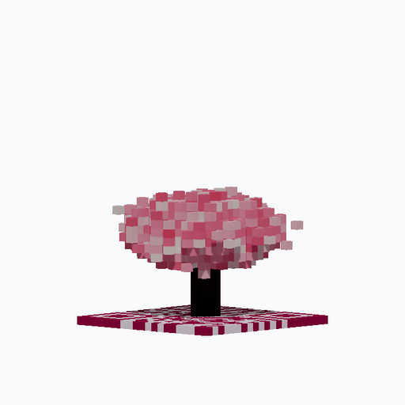

# QR-Bloom

A QR-conditioned 3D voxel diffusion model. It grows a 3D voxel tree whose
top-down silhouette is a scannable QR code: viewed from the side it is a tree,
viewed from above it is a working QR code.



## Overview

QR-Bloom is a denoising diffusion model that generates a 4-channel voxel grid
(RGB + occupancy). The grid size scales with the QR code version — taller
trees and wider footprints for larger codes. Generation is conditioned on:

- **QR footprint** — a QR code matrix. The model is constrained so that the
  tree's top-down projection reproduces the code, keeping it scannable.
- **Theme** — one of ten tree species: cherry blossom, pine, dragon tree,
  maple, baobab, willow, magnolia, saguaro cactus, palm, and acacia.
- **Shape attributes** — three continuous controls (height, fullness, spread)
  that let the user dial in the tree's proportions at inference time.

Training data is produced by a procedural voxel-tree generator, so the dataset
is effectively infinite and is generated on the fly during training — no data
files are stored on disk.

One UNet3D model is trained per QR version (v2..v5). A single shared model
across QR sizes underperformed because the receptive-field-to-grid ratio
changes with version; splitting one model per version lets each specialize.

## How it works

The model is a 3D U-Net trained with **v-prediction**: the network predicts the
diffusion `v` target rather than the clean sample or the noise directly.
Combined with stochastic (ancestral) sampling, this lets per-voxel color be
drawn from a distribution instead of regressed toward a mean — important
because foliage color is inherently varied, and a deterministic regressor
collapses it to a single dull average.

The shape attributes are trained with **classifier-free guidance**, so a user
can push the generator toward taller, fuller, or wider trees at sampling time.

## Repository layout

```
qrbloom/
  treegen.py     Procedural voxel-tree generator (10 species, per-species
                 augmentation built in)
  qr.py          QR-code generation and voxel-grid sizing helpers
  diffusion.py   v-prediction 3D U-Net and the diffusion process
train.py         Training entry point (one model per QR version)
evaluate.py      Quantitative evaluation (occupancy, color fidelity, diversity)
gallery.py       Interactive 3D web viewer (FastAPI)
Makefile         Task shortcuts (train, stop, gallery, status, logs, clean)
assets/          Demo assets
```

## Installation

```bash
pip install -r requirements.txt
```

Requires Python 3.10+ and a CUDA-capable GPU for training.

## Usage

### Training

The simplest way is the Makefile, which trains one model per QR version on a
separate GPU and writes per-version checkpoints / logs:

```bash
make train           # launch v2..v5 in parallel
make train-v2        # one specific version
make status          # GPU usage + live trainings + latest val_total
make stop            # kill all trainings
make logs-v2         # tail -f a single training's log
```

GPU assignment, BATCH size, and other knobs are Make variables — override at
the command line, e.g. `V2_GPU=0 V2_BATCH=64 EPOCHS=500 make train-v2`.
See `make help` for the full list.

If you'd rather drive `train.py` directly, every setting is also an
environment variable. Important ones:

| Variable             | Default  | Description                            |
|----------------------|----------|----------------------------------------|
| `VARIANT`            | `""`     | Suffix for checkpoints/runs dirs       |
| `QR_VERSIONS`        | `2,3,4,5`| Which QR versions to sample from       |
| `EPOCHS`             | `80`     | Number of training epochs              |
| `BATCH`              | `42`     | Per-GPU batch size                     |
| `LR`                 | `2e-4`   | Base learning rate                     |
| `T`                  | `500`    | Diffusion timesteps                    |
| `EPOCH_SIZE`         | `100000` | Live-generated samples per epoch       |
| `SAMPLE_STEPS`       | `100`    | Sampling steps for epoch previews      |

Single-version training writes:
- `checkpoints/qrbloom{VARIANT}.pt` — latest checkpoint
- `checkpoints/qrbloom{VARIANT}_best.pt` — best validation loss
- `runs{VARIANT}/epoch_{N}.json|.png` — per-epoch previews

For example, training v2 with `VARIANT=_v2` produces `qrbloom_v2.pt`,
`qrbloom_v2_best.pt`, and `runs_v2/`.

### Evaluation

```bash
python evaluate.py --checkpoint checkpoints/qrbloom_v2_best.pt
```

This samples trees from held-out QR codes and reports occupancy IoU against
the procedural ground truth, color-palette fidelity, per-tree color diversity,
and sample-to-sample diversity for a fixed QR code.

### Interactive gallery

```bash
make gallery           # CPU inference, safe alongside training
make gallery-gpu       # GPU inference (picks the first free GPU)
# Override the port: PORT=9000 make gallery
```

Or run directly:

```bash
python gallery.py --port 8000
```

Then open `http://localhost:8000`. The gallery is a FastAPI app that renders
generated trees in 3D and hot-reloads as new checkpoints appear during
training. Tilt the camera toward top-down and the tree's block colors resolve
into the scannable QR code.

## Docker

A prebuilt image is published to GitHub Container Registry on every push to `main`.

### Pull the prebuilt image

```bash
docker pull ghcr.io/rocknroll17/qr-bloom:latest
```

Specific commits are tagged `sha-<short-sha>`. The image is public, so no
`docker login` is required to pull.

### Run the gallery (CPU)

Safe to run alongside training. Mount the local `checkpoints/` directory
so the gallery can read the trained models:

```bash
docker run -d \
    --name qrbloom-gallery \
    --restart unless-stopped \
    -p 8000:8000 \
    -v "$(pwd)/checkpoints:/app/checkpoints:ro" \
    -e GALLERY_DEVICE=cpu \
    ghcr.io/rocknroll17/qr-bloom:latest
```

Then open `http://localhost:8000`. Use a different host port with
`-p 9000:8000`.

### Run the gallery (GPU)

Requires the [NVIDIA Container Toolkit](https://docs.nvidia.com/datacenter/cloud-native/container-toolkit/install-guide.html):

```bash
docker run -d --gpus all \
    --name qrbloom-gallery \
    --restart unless-stopped \
    -p 8000:8000 \
    -v "$(pwd)/checkpoints:/app/checkpoints:ro" \
    ghcr.io/rocknroll17/qr-bloom:latest
```

### Train inside the container

Mount the whole working tree so checkpoints, run directories, and source
edits are visible from the host:

```bash
docker run --rm --gpus all \
    -v "$(pwd):/app" \
    -e VARIANT=_v2 -e QR_VERSIONS=2 -e QR_VERSION_WEIGHTS=1.0 \
    -e BATCH=128 -e EPOCH_SIZE=80000 -e EPOCHS=300 \
    ghcr.io/rocknroll17/qr-bloom:latest \
    python train.py
```

### Stop / update

```bash
docker stop qrbloom-gallery && docker rm qrbloom-gallery
docker pull ghcr.io/rocknroll17/qr-bloom:latest        # grab newest build
# then re-run the docker run … command above
```

### Build locally instead

```bash
docker build -t qrbloom .
docker run -d -p 8000:8000 -v "$(pwd)/checkpoints:/app/checkpoints:ro" qrbloom
```

## License

Released under the MIT License. See [LICENSE](LICENSE).
